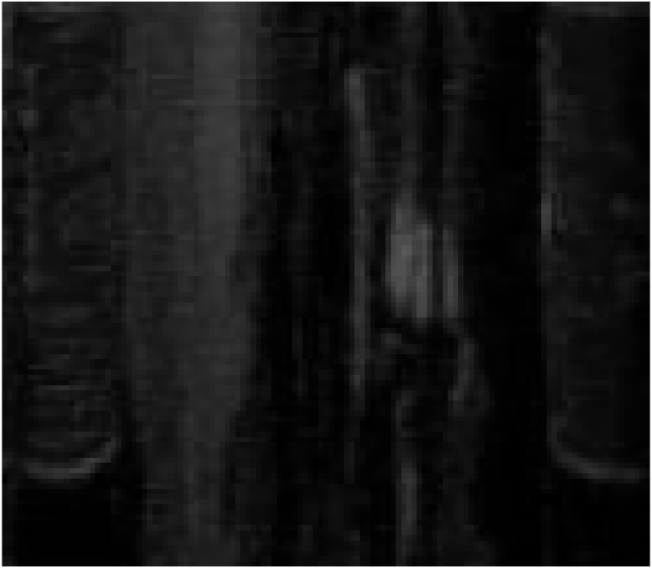
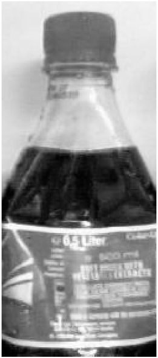

# cocacola-fault-detector
This document describes the design and development of a vision system developed for Assignment 1 of the EE551 Embedded Image Processing module.

# Introduction
This assignment attempts to classify images of Coca Cola bottles by their faults, without using AI, solely focusing on image processing techniques. A bottle that has no defects is classified as normal. Missing bottles will be ignored and only counted for evaluation purposes. Furthermore, the system classifies only the middle bottle in the image, other bottles in the same image will be disregarded even if they have faults.

In a scenario where multiple faults occur in the same bottle, each defect is classified independently

# Dataset Modifications
The provided dataset consisted of ambiguous cases and, for this project, was re-worked to reflect the problem better. Below are described the definitions by which the dataset was modified.

## Overfilled
Any bottle whose liquid level exceeded the norm (as shown in the picture above) is considered overfilled regardless of the reason behind the increased level, e.g. bottle deformation.

## Underfilled
Similarly, bottles with liquid levels falling below the previously established norm are viewed as underfilled.

## Lavel Not Straight
As shown below, any tilted or misaligned labels are considered not straight. However, the label will be regarded as straight if a bottle is deformed, but the label remains straight with respect to the deformity.

| Straight | Not Straight | Straight |
| :---: | :---: | :---: |
|  |  |  |

## Deformed
Bottles with any shape or form of deformity in the structure should be considered deformed.

## Set Completeness
Each set of faults in the dataset is complete – if an image consists of a (middle) bottle with more than one fault, it is placed in all respective folders.

It means that if a bottle is missing a cap and a label, the image will be present in both fault-folders.

This approach makes for much easier testing. For example, to estimate the classifier’s performance and generate a confusion matrix, only two folders with images have to be run for each fault; overfilled and not-overfilled.

# Early considerations and design choices

## Overall
Before designing the vision system, each fault detection was separated into simple and complex categories.

Everything besides deformity and label-is-straight faults was deemed relatively simple to detect. However, after closer inspection of the dataset, it was noticed that the bottles in the images had some horizontal shift – they were not always perfectly in the middle. It was not deemed a problem for simple tasks such as checking if there is a bottle cap etc., because big enough margins can be embedded into the algorithms. However, for more complex and sensitive fault detections, as those mentioned above, it posed a problem.

All simple bottle faults utilise the crop-and-histogram approach, where some portion of the histogram identifies a particular defect. This method proved to be very accurate.

## Code Structure
The entry point for the system is a MATLAB script file named main. Each fault has its own appropriately named function in a separate script file in the faults folder, making the code easier to work with and more readable. The scripts are imported by the main file and run as needed.

Utility functions are stored in the utils folder (as scripts) and imported into the main file. They can also be used in fault detecting scripts.

# Design and Techniques

## Main Pipeline

### Image Selection
The user must select a folder with the images they want to run. The chosen images are randomised and iterated over, and the classification results are collected for each iteration.

### Pre-processing
The image is approximately cropped and converted to grayscale (as shown below).

None of the algorithms required the colour channels, hence the early conversion to grayscale. The processed image is then fed to the fault detection algorithms.

## General Approach to Simple Tasks
The approach to solving relatively simple tasks was to identify the area of interest and determine what range of values best describes different states of that area. For example, a bottle with an incorrectly printed label will have more high-intensity (white) values in a histogram than a bottle with a correctly printed label which consists of more mid-intensity (red) values.

A histogram can be split into bins; the higher the number of containers, the higher the resolution of the histogram. For example, a histogram with a single bin would have a single value which would be a sum of all values in the range of `0-255`. 

This method of crop-and-histogram is repeated several times throughout this project. 

## Missing Bottle
A histogram of the provided image (from the pre-processing section) is calculated. Presented below are the histograms for two images. The picture with no bottle has a distinct high-intensity signature with no lows-intensity values – bright pixels are the most frequent. Therefore, histograms with two bins are made for each image, representing values of `0-124` and `125-250`, respectively. An `8000` threshold was chosen for the first bin, which determines if a bottle is present in the image or not.

| Image | Histrogram |
| :---: | :---: |
|  |  |
| | Bins: `[13339; 33029]` |
|  |  |
| | Bins: `[2735; 43633]` |

## Bottle Cropping
While the initial problem of horizontal bottle shift was skipped over, eventually, it had to be solved so that more accurate algorithms could be implemented.

### Problem
Each image has the middle bottle in a slightly different horizontal position. This was initially combated by implementing wider cropping margins, but eventually, those margins were removed in favour of a better solution.

### Solution
After detecting if a bottle is present in the image, the neck of the bottle is cut out. The resulting image has its column values summed, creating a single vector describing the total intensity of each column.

| | |
| :---: | :---: |
|  |  |

As can be seen above (blue line), the resulting line (vector) dips significantly when the neck of the bottle is encountered; this is because there are more mid-intensity values compared to the almost entirely high-intensity (white) background.

To detect those dips, a derivative is calculated, and the positions of min and max values are found. The calculated derivative is shown in the images below (orange line).

| | |
| :---: | :---: |
|  | 

Having these two positions describing the beginning and end of the neck of the bottle, the edges of the bottle can be calculated with the following formulas **Bleft = pmin – (rb – rc) and Bright = pmax + (rb – rc)** where **B** is the position of the edge of the bottle, **p** is the position of the min/max values of the derivative, **rb** is the radius of the bottle and **rc** is the radius of the bottle’s cap/neck. The final result of this calculation can be seen below.

| | |
| :---: | :---: |
|  | 

### Outcome
The resulting algorithm proved incredibly effective and played a significant role in developing more sensitive algorithms and improving their accuracy.

## Bottle Cap
Relatively easy design following the crop-and-histogram pattern, the area of interest is cropped out, and a histogram of that area is taken.

| Image | Histrogram |
| :---: | :---: |
|  |  |
| | Bins: `[0; 0; 0; 1146; 1371; 1113]` |
|  |  |
| | Bins: `[0; 0; 2492; 412; 660; 66]` |

As shown above, in this case, the area differentiating the two images is located around an intensity of `130`. The histogram is split into six bins, with a threshold of `1000` on the third bin, determining if a bottle has a cap.

## Overfilled

| Image | Histrogram |
| :---: | :---: |
|  |  |
| | Bins: `[268; 2790; 5609]` |
|  |  |
| | Bins: `[1539; 3020; 5242]` |

Above, we can see the continuing pattern of the crop-and-histogram approach. In this scenario, the low-intensity values are the most relevant. The histogram was split into three bins, and a threshold of `700` was chosen for the first bin.

## Underfilled
An area just above the label but below the normal fill level is cropped out. The difference between the two histograms of that area is evident at first glance. The underfilled bottles have almost no low-intensity values. The histogram is created with three bins, and a threshold level of `2000` was chosen for the first bin, representing all pixels below the intensity of `83`.

| Image | Histrogram |
| :---: | :---: |
|  |  |
| | Bins: `[2455; 1573; 490]` |
|  |  |
| | Bins: `[0; 688; 3310]` |

## Has Label
For the label, the histogram was split into three bins. Bottles without a label seem to have many low-intensity values because the liquid rather than the label is seen. A scenario where a bottle is underfilled and missing a label could not be tested since there are no examples of this combination of defects in the provided dataset.

The first bin in the histogram is responsible for label detection. A threshold of `10000` was chosen.

In a scenario where underfilled bottles with missing labels must be detected, a combination of two algorithms could be used - one algorithm for detecting white labels and another for detecting red labels.

| Image | Histrogram |
| :---: | :---: |
|  |  |
| | Bins: `[1497; 7609; 4519]` |
|  |  |
| | Bins: `[13527; 98; 0]` |

## Label Print
The label area was cut out for this fault, and histograms were calculated.

| Image | Histrogram |
| :---: | :---: |
|  |  |
| | Bins: `[705; 6004; 2172; 3103]` |
|  |  |
| | Bins: `[624; 338; 1726; 9296]` |

## Straight Label
A different method was used for detecting a straight label. Each label is white or has a distinct white stripe at the top. The algorithm leverages this characteristic and checks if the stipe is positioned horizontally.

First, the area of interest, the label, is cropped out. Then canny’s edge detection algorithm is used to find the edges in the image, resulting in a binary map of edges. The resulting binary image is then dilated **vertically** – this helps to account for any irregularities in edge detection and combat the slight curvature of the label. The obtained image is then further cropped, and only the middle-top section of the label is kept (the curvature on the sides of the label breaks this algorithm). The label is considered straight if the final image has at least one row of all 1s – a function was developed for this purpose specifically.

Note that this will also work with completely white labels since the edge of the label will also be detected.

| Stage | Straight | Not Straight |
| :---: | :---: | :---: |
| Cropped Out Label |  | 
| Canny's Edge Detection |  | 
| Vertical Dilation |  | 
| Cropped Out MIddle Section |  | 

## Deformity
The deformity detection algorithm heavily relies on the performance of the bottle cropping algorithm. This method calculates an **anti-symmetry** score for each bottle; if the anti-symmetry score is above a certain threshold, the bottle is classified as deformed.

Since the bottle is already cropped out with high accuracy, the edges of the bottle can be extracted as shown below (`S1` and `S2`). These two areas of the bottle most accurately determine if a bottle is deformed.

The whole image is blurred before extraction to remove any high-frequency noise that negatively affects the anti-symmetry score.

| | |
| :---: | :---: |
|  | 

The image values are normalised (divided by `255`), and the second image `S2` is flipped. Then the two images are subtracted from each other, and the difference is squared. The reason for squaring the difference is that big differences between images are more significant than small ones. The output of this operation can be seen below (values normalised in the range of `0-255`).

| Not Deformed | Deformed |
| :---: | :---: |
|  |  |
|  |  |
| Anti-symmetry Score: `26.3067` | Anti-symmetry Score: `327.3082` |

An anti-symmetry score is calculated by summing all the values in the matrix; the higher the score, the bigger the difference between the two images.

An anti-symmetry threshold of `115` was chosen for best performance.

# Results

## Underfilled

| | True | False |
| :---: | :---: | :---: |
| **Predicted True** | `13` | `0` |
| **Predicted False** | `0` | `116` |

Accuracy: `1`

Precision: `1`
  

## Overfilled

| | True | False |
| :---: | :---: | :---: |
| **Predicted True** | `42` | `0` |
| **Predicted False** | `0` | `87` |

Accuracy: `1`

Precision: `1`
  

## Bottle Cap

| | True | False |
| :---: | :---: | :---: |
| **Predicted True** | `114` | `0` |
| **Predicted False** | `0` | `15` |

Accuracy: `1`

Precision: `1`
  

## Label

| | True | False |
| :---: | :---: | :---: |
| **Predicted True** | `118` | `0` |
| **Predicted False** | `0` | `11` |

Accuracy: `1`

Precision: `1`
  

## Label Is Straight

| | True | False |
| :---: | :---: | :---: |
| **Predicted True** | `104` | `0` |
| **Predicted False** | `2` | `12` |

Accuracy: `0.9831`

Precision: `1`

The two false positives are shown below. Their deformity interferes edge detection of the algorithm. Perhaps a thresholding approach would be a better method instead of edge detection.

| | |
| :---: | :---: |
|  |  |

## Is Deformed

| | True | False |
| :---: | :---: | :---: |
| **Predicted True** | `10` | `0` |
| **Predicted False** | `1` | `118` |

Accuracy: `0.9922`

Precision: `1`

Below is shown the single false positive case. The algorithm failed to classify this bottle as deformed because the deformity did not break the bottle’s symmetry.

## Label Has Pring

| | True | False |
| :---: | :---: | :---: |
| **Predicted True** | `105` | `0` |
| **Predicted False** | `0` | `13` |

Accuracy: `1`

Precision: `1`
  

## Middle Bottle Detection

| | True | False |
| :---: | :---: | :---: |
| **Predicted True** | `129` | `0` |
| **Predicted False** | `0` | `12` |

Accuracy: `1`

Precision: `1`
  

## Overall

Found good bottles: `51/129`

Found faulty bottles: `78/129`

# Conclusion

The system’s performance is excellent. However, there is insufficient testing data to test this with high accuracy.

The **bottle cropping algorithm** made all the difference; the effort put into it directly translates to good results in all fault detections, especially the Label is Straight and Deformity algorithms which rely on the bottle being in the middle.

The Label is Straight algorithm could be further improved or even entirely re-worked.

